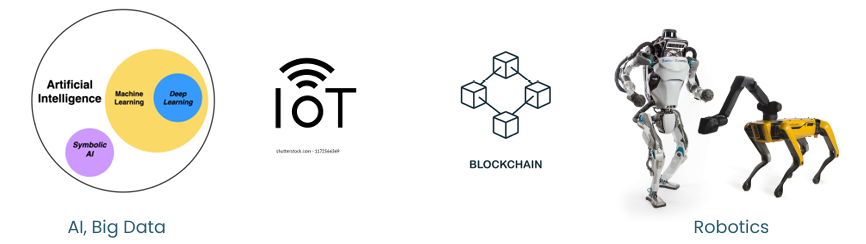

In the fast-paced world of technology, established firms must navigate numerous risks and challenges to capitalize on emerging technologies. This blog explores key strategies to avoid common pitfalls and leverage new technologies effectively.

### Defining Emerging Technologies

Emerging technologies are those in the early stages of development but expected to have a significant impact on industries. They often challenge established strategies and can lead to market shifts. Companies developing these technologies frequently lead the market, while established firms struggle due to technical uncertainties and ambiguous market signals.

## Common Pitfalls for Established Firms

1. **Delayed Participation**: Hesitation in adopting new technologies can result in missed opportunities.  
 
Blockbuster delayed entry allowed Netflix to establish dominance. By the time blockbuster reacted it was too late to even compete

2. **Sticking to Known Technology**: Over-reliance on existing technologies can hinder innovation.  
 
Kodak was reluctant to shift from film-based photography to digital technology, despite having invented the digital camera – Canon took over

3. **Reluctance to Commit Fully**: Partial commitment can prevent firms from reaping the full benefits of new technologies.  
 
Microsoft initially resisted cloud computing – allowed Amazon with AWS & Google with Google Cloud to dominate before Microsoft could catch up.

4. **Lack of Persistence**: Inconsistent efforts can lead to failure in fully integrating and capitalizing on emerging technologies.  
 
HP’s tablet market with TouchPad was short-lived, discontinued product after few weeks of launch – poor sales.

### Pitfall 1: Misjudging Technology Readiness

Selection bias often leads firms to overestimate the readiness of new technologies, resulting in financial losses and damage to reputation. This can be mitigated by implementing phased testing and integration plans. For example, Google Glass's early release faced privacy concerns and limited applications due to misjudged readiness.

 Google glass’s early release highlighted Privacy
concerns and limited practical applications.

### Pitfall 2: Underestimating Integration Challenges

Integrating new technology into existing frameworks can disrupt operations and increase costs. Comprehensive impact assessments and pilot projects are essential to prevent such issues. Renewable energy sources, for instance, pose significant integration challenges into traditional energy grids.

### Pitfall 3: Overlooking Organizational Learning Curves

Organizations often neglect the time and resources needed for teams to adapt to new technologies, leading to inefficiencies and potential misuse. This can be avoided through training programs and phased technology deployment, ensuring the workforce is prepared for the shift.

 
Companies adopting AI without preparing their workforce for the shift - in the sense that not everyone knows how to prompt an AI to get the desired result, 
- it may lead to buggy software development when used as a coding assistant, or 
- lead to misinformation or obsolete information in law/journalism

### Mitigating Risks

1. **Early Warning Signals**: Monitor market and technological developments to detect early warning signals.  Example: Allows Microsoft to invest in promising startups and techs, staying ahead of potential market shifts

2. **Strategic Experimentation**: Conduct small-scale tests to understand new technologies before full commitment. Alphabet’s Google X exemplifies this approach with its controlled, project-based experimentation.  Example: Google X: Waymo – vehicle; balloon powered internet - Project Loon

3. **Flexibility and Adaptation**: Treat investments in new technologies as options, allowing for strategic adjustments as the landscape evolves. Apple’s shift from iPod to iPhone demonstrates effective adaptation.  Example: Amazon’s approach to new market entries involves small-scale pilot tests and iterative development – allows Amazon to explore various business models flexibly. Grocery delivery – started in small regions & expanded

4. **Organizational Separation**: Create dedicated units for new technologies to protect core business while fostering innovation. Amazon Web Services (AWS) is a prime example of this strategy.  Example: Alphabet (Google’s parent) – various subsidiaries to isolate financial risks & focus of various projects – Waymo autonomous cars; Verily life sciences – more focused innovation and resource allocation in emerging techs

### Importance of Adaptive Strategies

Businesses must remain flexible and adaptable to leverage technological advancements. This includes building a culture of continuous learning, gathering and acting on feedback efficiently, and adjusting business models to accommodate new technologies.

### Role of Leadership

Leadership is crucial in guiding technology adoption strategies. Effective resource distribution, fostering an environment for creativity, and facilitating change management are essential responsibilities of CEOs and top management.

### Case Studies

- **Successful Integration**: Tesla’s gradual integration of AI in vehicle automation showcases the importance of strategic partnerships, robust testing environments, and transparency.

 
 &nbsp; &nbsp; &nbsp; &nbsp; &nbsp; &nbsp; &nbsp; 

- **Learning from Failures**: Samsung’s Galaxy Note 7 incident highlighted the need for thorough testing and improved crisis management. Samsung’s response included a new battery safety check process and better product testing protocols.

 &nbsp; &nbsp; &nbsp; &nbsp; &nbsp; 

### Conclusion

Avoiding pitfalls in emerging technologies requires strategic foresight, flexibility, and a commitment to continuous learning. By implementing these strategies, established firms can effectively navigate the complexities of innovation and maintain their competitive edge in an ever-evolving market.

### References
1. Day Schoemaker, 2000, Avoiding the Pitfalls of Emerging Technologies. CMR.
2. https://medium.com/@seanmoffitt/the-top-30-emerging-technologies-2018-2028-eca0dfb0f43c 