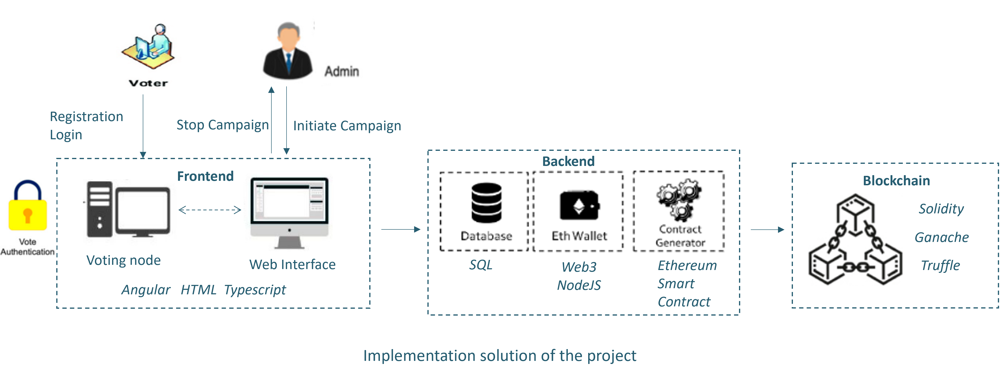
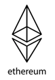
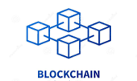
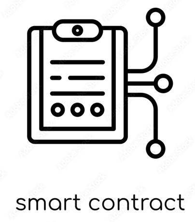

# Blockchain-based Decentralized Voting System

Within this project, the goal is to implement a decentralized, high-availability voting system using smart contracts on a private Ethereum blockchain. 
The system should be able to authenticate users, register them for voting on the network, handle the actual voting process and finally provide 
the results to an administrator. Each voting session has to be initiated by an administrator, who registers the election candidates in the system and also sets the duration of the election campaign. The system needs to be set up as a Web app that has two frontends: one for the voters and one for the administrator.

The architechture looks like follows:

## Design Decisions

We made the following design decisions  
1. Authentication process for the users: Voter ID, Email, Password, OTP, Admin Approval 

2. Storing user and candidate information: user data is stored on MySQL database; candidate data is stored on blockchain. 
 
3. Preventing voters from voting more than once: handled in the smart contract. Upon reset (repetition of election), voter will be able to vote again 

4. Preserving privacy and fairness: Votes cannot be seen by anyone, only a transaction hash is generated. Handled in the smart contracts. 

5. Each user assigned with a wallet: The list of address from Ganache are obtained and assigned automatically to each user in the backend. 

6. Functionalities in the smart contract:
    - Add candidates
    - Start and Stop Election
    - Cast Vote
    - Get Statistics
    - Reset to restart the Election
 
7. Number of Docker containers used: 3
    - Frontend
    - Database
    - Backend
 

8. Google Cloud Platform Service 

## My Contributions
As the team coordinator, I gained valuable leadership experience. I discovered my ability to effectively coordinate with team members, assign tasks, resolve conflicts, and motivate the team. Additionally, I was adept at identifying and addressing any issues that arose. My contributions included developing the user interface and assisting with backend and blockchain development.



