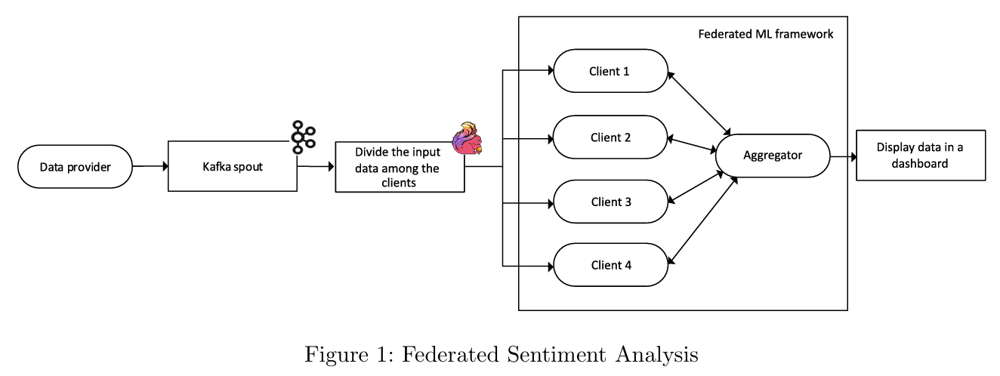

# Federated Sentiment Analysis
**Currently in Progress**

Sentiment analysis is a fascinating area within natural language processing (NLP) that delves into identifying, extracting, and quantifying emotions and opinions expressed in written text. In my current project, I aimed to develop a system capable of analyzing sentiment from Reddit comments, focusing on whether sentiments towards specific keywords like "Trump" or "Biden" are positive or negative.

The low level implementation looks like:

This project leverages federated learning, a cutting-edge approach in machine learning. Instead of relying on a centralized model, federated learning involves distributing data across multiple clients. Each client trains a local model, which is then aggregated into a global model. This methodology enhances privacy and reduces the need for massive data transfers, making it ideal for large-scale sentiment analysis tasks.

## Data and Tools
I used the Pushshift Reddit Dataset, specifically focusing on comments from April 2019. This dataset is huge with 165 GB, so I only used a portion of it to make our project manageable. 
Apache Kafka was used to manage the data stream, feeding it into Apache Flink for processing. The sentiment analysis models were trained using TensorFlow Federated, a framework tailored for federated learning.

## Implementation
The implementation is divided into 2 main stages.

**Stage 1: Local Setup and Training**
1. Apache Kafka setup: Configure Kafka to manage and stream reddit comments.
2. Data Provider: Developed a producer for Kafka to subit comments in the order they were recorded.
3. Apache Flink setup: Configure Flink to process the data streams and train local models.
4. Basic Federated Learning Solution: Implementing the initial federated learning framework, enabling local models to be aggregated into a global model.

**Stage 2: Cloud Deployment and Iterative Training**
1. Web-based GUI: Create a basic web interface allowing users to enter keywords and view sentiment analysis results over time.
2. Cloud Deployment: deploy the solution onGoogle Cloud Platform, using Docker containers to ensure scalability and reliability.
3. Iterative Training: enable multiple training iterations to refine the sentiment analysis models continually.

## Expected Outcomes
The project aims to produce a robust sentiment analysis system capable of adapting to new data over time. The iterative training approach ensures that the model remains accurate as more Reddit comments are processed. Additinally, the project highlights the advantages of federated learning in managing large-scale NLP tasks while maintaining data privacy.

## My Contributions
As the team coordinator, I gained valuable leadership experience. I discovered my ability to effectively coordinate with team members, assign tasks, resolve conflicts, and motivate the team. Additionally, I was adept at identifying and addressing any issues that arose. 

My contributions include setting up Kafka and Flink, documenting and making presentations for interim and final evaluation, and deploying to Cloud.



